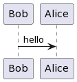

[](https://actions-badge.atrox.dev/lonnblad/gopuml/goto?ref=main)
[](https://goreportcard.com/report/github.com/lonnblad/gopuml)
[](https://coveralls.io/github/lonnblad/gopuml?branch=main)

# gopuml

gopuml is a CLI tool to compile [Plant UML](https://plantuml.com/) into images and links.

It has support for generating png, svg and txt output either as files or links. gopuml is built in golang and leverages [plantuml.com](https://www.plantuml.com/) to generate the output.

## Example:

gopuml can convert this example text into a file or a link, in this example, using the svg formatter.

### Plant UML


### Generated SVG file

> gopuml build -f svg example/example.puml


### Generated SVG link

> gopuml build -f svg --style link example/example.puml

https://www.plantuml.com/plantuml/svg/SYWkIImgAStDKN2jICmjo4dbSifFKj2rKt3CoKnELR1Io4ZDoSddSaZDIodDpG44003__m00

## Table of Contents

- [Usage](#usage)
  - [Install](#install)
  - [Compiling UML](#compiling-uml)
  - [Development Environment](#development-environment)
- [Examples](#examples)

## Usage

### Install

> go install github.com/lonnblad/gopuml/cmd/gopuml@v0.2.1

### Compiling UML

The command used to compile the Plant UML to different formats.

> gopuml build [files]

To test the build feature in the gopuml repository:

> gopuml build example/example.puml

#### Options

- **-f, --format**

  The format to use when compiling the Plant UML, defaults to: `svg`.

  Supported formatters are:

  - `png`, will format the content as .png
  - `svg`, will format the content as .svg
  - `txt`, will format the content as .txt

- **--server**

  The Server URL to use when the style used is `link`, defaults to: `https://www.plantuml.com/plantuml`.

- **--style**

  The style to use when compiling the Plant UML, defaults to: `file`.

  Supported styles are:

  - `file`, will write the formatted content to a file
  - `link`, will write a link to the formatted content to stdout
  - `out`, will write the formatted content to stdout

### Development Environment

gopuml supports running a local webserver which will automatically reload the rendered version of the Plant UML as they are updated

> gopuml serve [files]

To test the serve feature in the gopuml repository:

> gopuml serve example/example.puml

#### Options

- **-p, --port**

The port to use to serve the HTML page, defaults to: `8080`.

## Examples

These examples can be found [here](example).

### [example.puml](example/example.puml)

The source Plant UML.


### Compile files

#### Compiles [example.png](example/example.png).

> gopuml build -f png example/example.puml



#### Compiles [example.svg](example/example.svg).

> gopuml build -f svg example/example.puml


#### Compiles [example.txt](example/example.txt).

> gopuml build -f txt example/example.puml

```txt
     ┌───┐          ┌─────┐
     │Bob│          │Alice│
     └─┬─┘          └──┬──┘
       │    hello      │
       │──────────────>│
     ┌─┴─┐          ┌──┴──┐
     │Bob│          │Alice│
     └───┘          └─────┘
```

### Generate links

#### Generates a link for the [example.png](https://www.plantuml.com/plantuml/png/SYWkIImgAStDKN2jICmjo4dbSifFKj2rKt3CoKnELR1Io4ZDoSddSaZDIodDpG44003__m00).

> gopuml build -f png --style link example/example.puml

#### Generates a link for the [example.svg](https://www.plantuml.com/plantuml/svg/SYWkIImgAStDKN2jICmjo4dbSifFKj2rKt3CoKnELR1Io4ZDoSddSaZDIodDpG44003__m00).

> gopuml build -f svg --style link example/example.puml

#### Generates a link for the [example.txt](https://www.plantuml.com/plantuml/txt/SYWkIImgAStDKN2jICmjo4dbSifFKj2rKt3CoKnELR1Io4ZDoSddSaZDIodDpG44003__m00).

> gopuml build -f txt --style link example/example.puml
